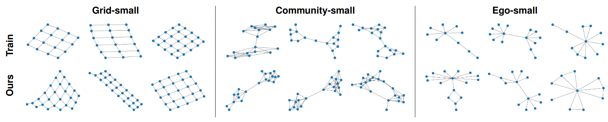

# Graph Recurrent Neural Networks (GraphRNN)

Authors: Maya Ravichandran, Mark Koch, Taniya Das, Nikhil Khatri (all authors contributed equally)

Reproducibility experiments for the [GraphRNN](https://arxiv.org/abs/1802.08773) model, evaluation on expanded metrics, an ablation of study of breadth-first search traversal, and novel extension for generation of directed acyclic graphs.

Results published in this [report](https://arxiv.org/abs/2307.14109) (accepted to NeurIPS 2023: New Frontiers in Graph Learning workshop).

## Requirements
The following Python libraries are required:
- `pytorch >= 1.10`
- `tensorboard >= 2.8`
- `networkx >= 2.6.3`
- `pyyaml >= 6.0`
- `pyemd >= 0.5.1`

## Extensions

- We added additional evaluation metrics:
  - Betweenness Centrality
  - Degree Centrality
  - Density
  - Triadic Closure
- We added support for generating directed graphs and a special mode for generating DAGs

## Acknowledgement
The authors' original implementation can be found [here](https://github.com/snap-stanford/GraphRNN).
